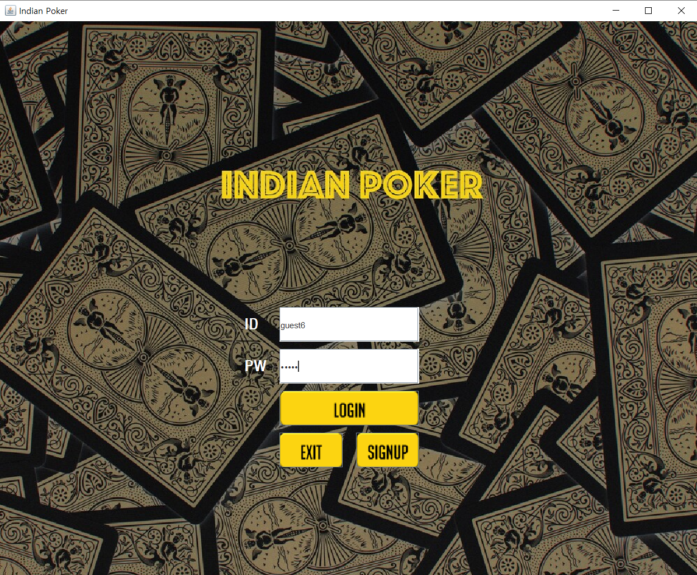
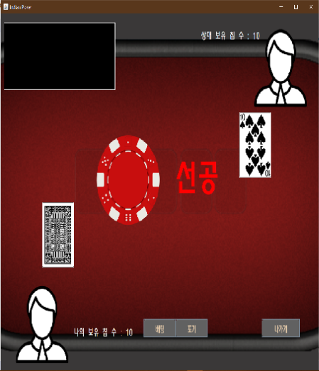

#  IndianPoker Network Game _2019 객체지향기술 팀프로젝트
     
> 인디언 포커게임을 온라인으로 1:1 대결을 즐길 수 있는 서비스

## :memo:프로젝트 개요

 팀 프로젝트를 제안하면서, 게임 개발은 한번 시도해 보자는 의견이 있어서 게임 중에서 인기가 있는 인디언 포커를 만들려고 합니다. 
 
 인디언 포커는 “더 지니어스”라는 예능에서도 큰 인기가 있었던 게임으로 심리전을 요구하는 카드 게임입니다. 
 
 인디언 포커 룰은 나라마다 조금씩 다른데, 위 블로그 링크에 있는 규칙으로 정해 게임을 만들 예정입니다. 
 
 *블로그 링크:
 
 https://m.blog.naver.com/PostView.nhn?blogId=una4871&logNo=120204854040&proxyReferer=https%3A%2F%2Fwww.google.com%2F

## :computer:프로젝트 기능
1. 게임을 접속하기 위해 회원가입을 하고 로그인하는 기능

2. 게임을 할 수 있는 대기방을 만들고 대기방을 접속해 1:1 매치를 할 수 있는 기능, 대기방에서 그 동안 쌓인 승/패 전적을 확인할 수 있는 기능

3. 1:1로 인디언 포커 게임을 사용할 수 있는 기능

4. 승패 전적으로 랭킹 시스템을 확인할 수 있는 기능

5. 게임 중에 사용자가 감정표현을 할 수 있게 이모티콘을 띄우는 기능

## :man_dancing:팀원 소개 및 역할:dancer:

| 이름 | 역할 | 세부사항 |
|---|:---:|:---:|
|박서인|프론트엔드,디자인|GUI 전체 디자인 및 구현|
|설민욱|백엔드,문서화|Database 구현, Ranking system 구현 담당|
|이명우|백엔드|1:1 인디언 포커 게임 구현 담당|
|박수한|백엔드|로그인, 회원가입 기능 구현 담당|

## :framed_picture: 시스템구조도 & GUI구성도</STRONG>
* 시스템 구조도

* GUI 구성도(초기화면)
 

* GUI 구성도(회원가입)
 

* GUI 구성도(대기방)
 

* GUI 구성도(게임방)

 

## :footprints: UPGRADE
2020.2.10 수정본입니다.
 
